LSTM Autoencoder for Anomaly Detection_by Brent Larzalere](https://towardsdatascience.com/lstm-autoencoder-for-anomaly-detection-e1f4f2ee7ccf) 를 참고하여 분석을 진행하였습니다.

### Analysis Dataset

UCR의 ECG data를 사용하여 분석을 진행한다. train dataset에는 정상 데이터만 존재하며, test dataset에는 이상 징후가 포함되어있다. 원데이터를 받아서 data를 나누어 사용했으며 원데이터는 [여기](http://www.cs.ucr.edu/~eamonn/discords/)에서 받을 수 있다.

### Load , Pre-Process & Review Data

python 3 jupyter notebook에서 만들어졌으며, TensorFlow를 백엔드로 사용하고 Keras를 사용한다. 라이브러리를 로드하고 시드를 설정한다.

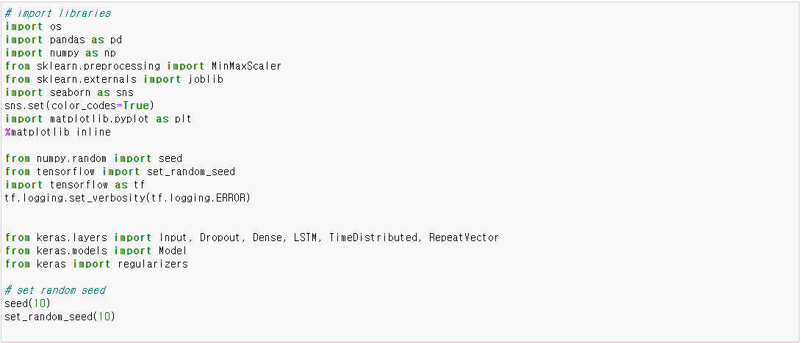

train 데이터에는 정상 signal만 포함되어있으며, test데이터에는 이상 + 정상 signal이 존재한다. train, test 데이터를 불러오고 Target1, Target2만 학습에 사용하므로 이 부분만 train, test에 저장한다.

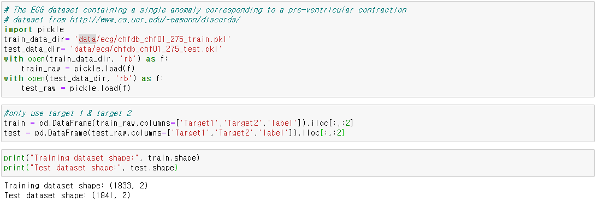

정상 데이터의 시계열 그림은 아래와 같다.

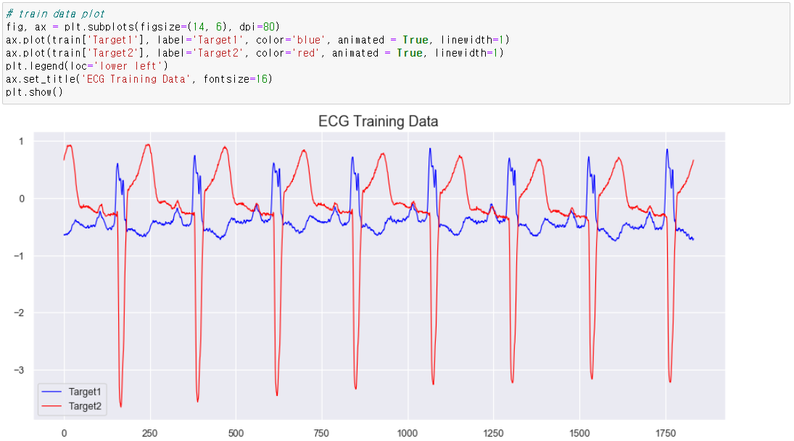

데이터의 전처리를 위하여 0과 1사이로 normalize를 수행한다. 그런 다음 LSTM 네트워크에 입력하기 적합한 형식으로 데이터를 재구성한다. LSTM 셀은 **\[data samples, time steps, features\]**의 3차원 형식을 필요로한다. 여기서 LSTM 네트워크에 입력되는 각 sample은 2개의 feature를 가진 one step을 나타낸다.

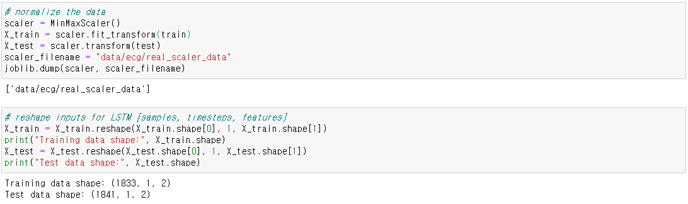

LSTM 셀의 장점 중 하나는 다변량 feature를 분석에 포함할 수 있다는 것이다. 여기서는 one time step마다 4개의 센서 측정 값이다. 온라인 사기 이상 징후 탐지 분석의 경우 feature는 time of day, dollar amount, item purchased, internet IP per time step 으로 구성될 수 있다.

### Neural Network Model

이상 감지를 위해서 autoencoder neural network architecture를 사용한다. 이상 탐지에 이 구조를 사용하는 이유는 "정상" 데이터에 대해 모형을 학습하고, 재구성오류(reconstruction error)를 확인하기 위해서다. 모형이 정상 범위 바깥의 데이터를 만나서 재구성하려 시도하였을때, 재구성 오류가 증가하는 것을 확인할 수 있다. 이는 모형이 이상 데이터에 대해 학습되지 않았기 때문이다.

Keras 라이브러리를 사용하여 autoencoder neural network model을 생성한다.

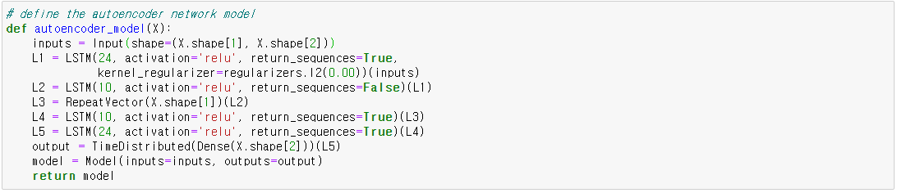

[repeat vector layer 참고자료](https://stackoverflow.com/questions/51749404/how-to-connect-lstm-layers-in-keras-repeatvector-or-return-sequence-true)

모형 설계 후 최적화 알고리즘으로 Adam을 사용하고 loss로 mae를 사용한다.

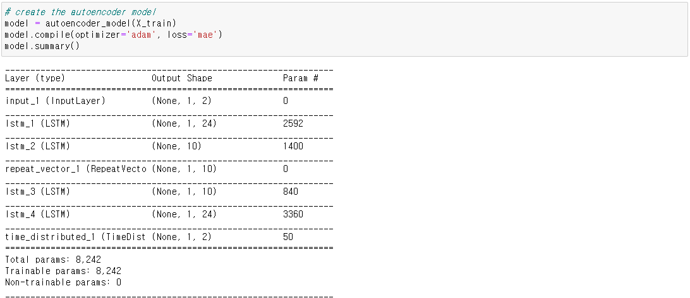

마지막으로 100번의 epoch동안 학습시킨다. 모형 성능 평가를 위해 학습 loss를 plot으로 표현한다. 편의상 earlystop은 사용하지 않았다. 추후 모형을 심화시키기 위해서는 earlystop, learning_rate 등 옵션들을 조정해야할 것이다.

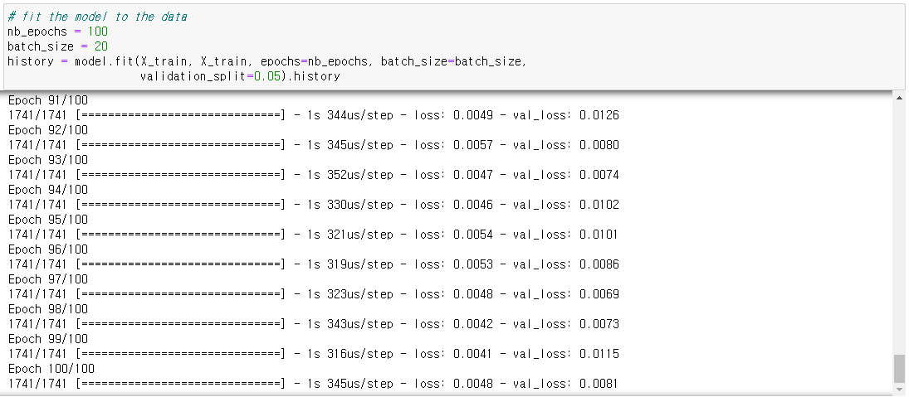

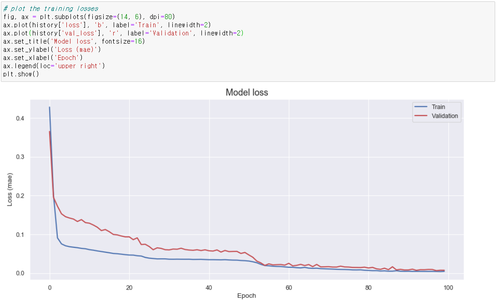

### Loss Distribution

학습 데이터 세트에서 계산된 loss의 분포를 그려서 이상 식별에 적절한 임계값을 설정할 수 있다. 이렇게하면 임계값이 "noise level" 이상으로 설정되어 오탐지가 발생하지 않도록 할 수 있다.

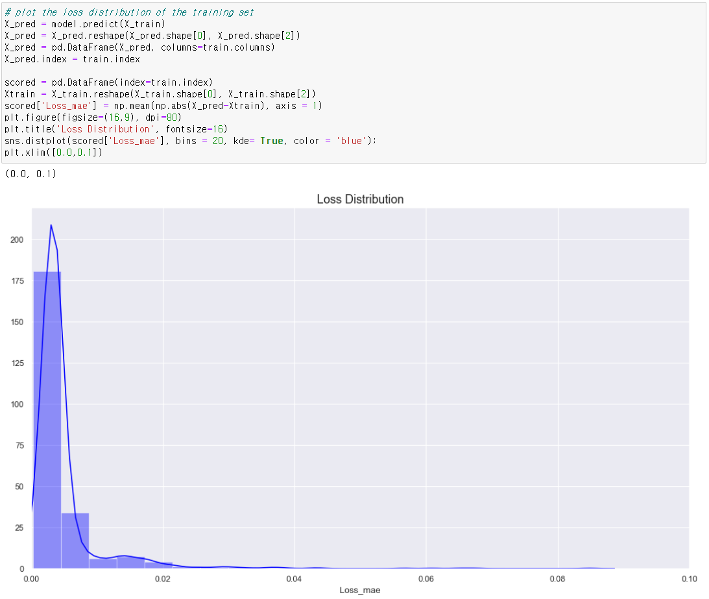

위의 손실 분포를 기반으로 이상 탐지의 임계값을 0.08487로 사용하였다. 그런 다음 테스트 데이터에서 재구성 손실을 계산하여 센서 판독값이 임계 값을 초과하는 시점을 판단한다.

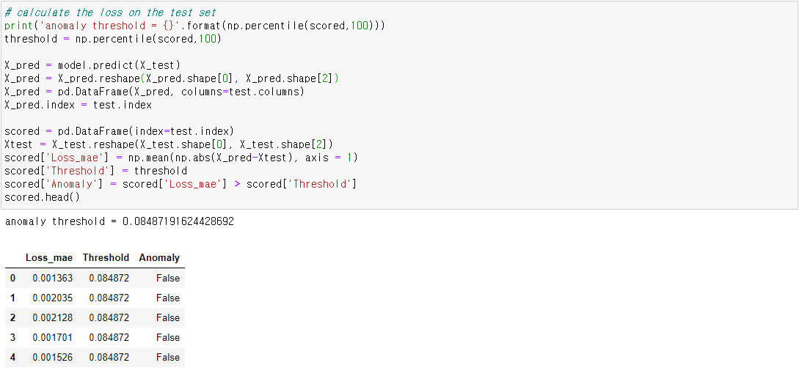

빨간 선은 임계값인 0.08487를 나타낸다.

실제 test 데이터에 대해 이상이라고 판정한 부분을 빨간색 점으로 표기를 하고 실제 이상 label 영역을 회색 영역으로 표시하였다. 이전에 살펴본 LSTM network를 이용한 시계열 이상 탐지에서는 " ‘anomalous’으로 예측된 시퀀스의 point 중 상당 부분(유의한 비율)이 비정상이면 충분하다"고 했다. 여기서도 이상 label 부분에서 이상이라고 판정된 점들을 확인할 수 있다.

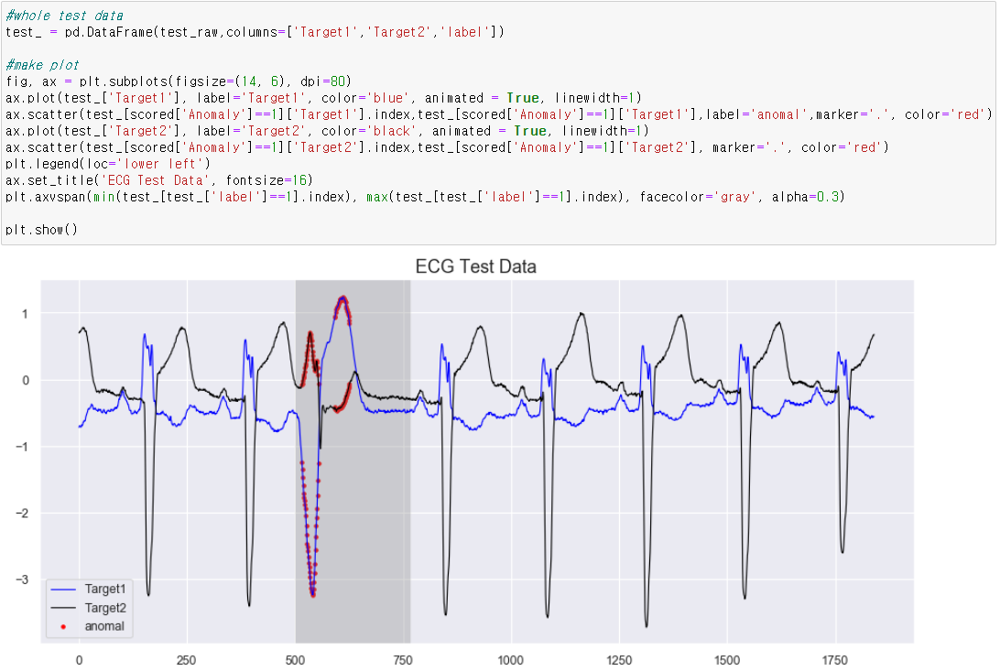

마지막으로 신경망 모형과 가중치를 h5형식으로 저장한다.

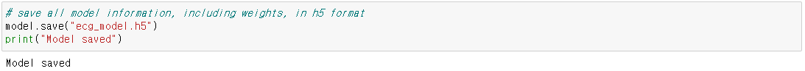
